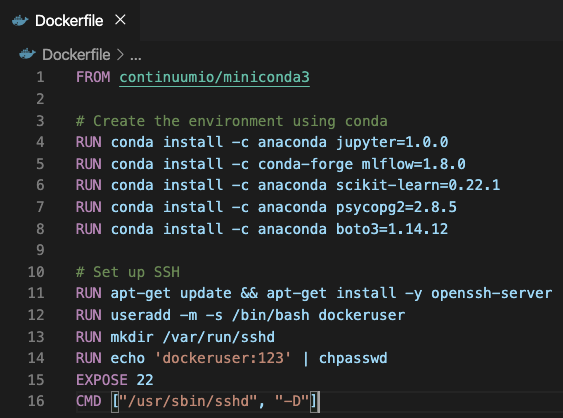
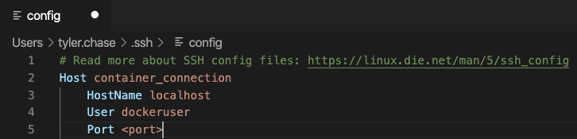
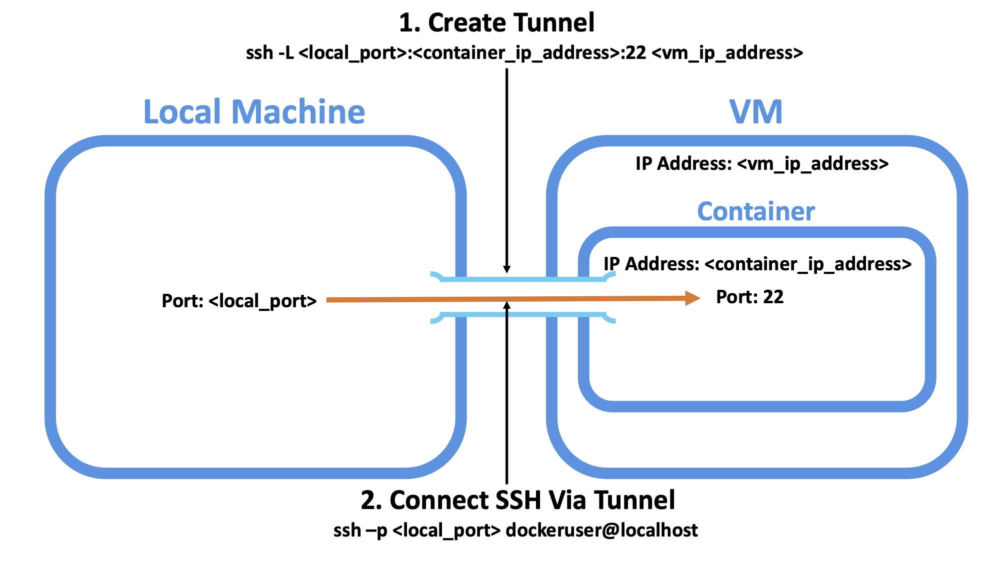
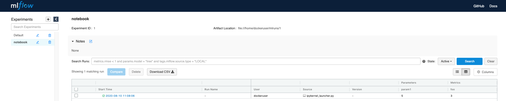
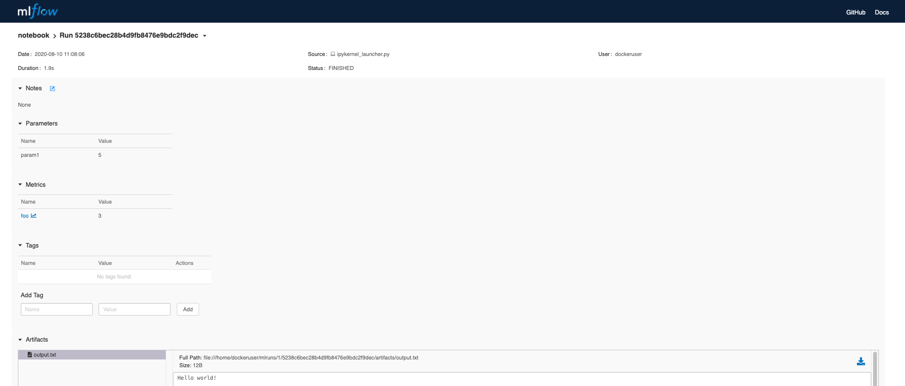
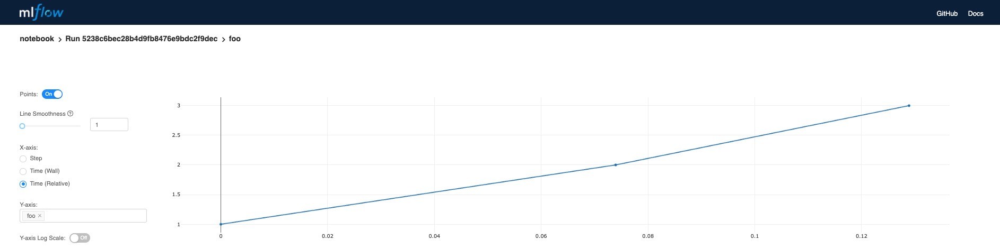
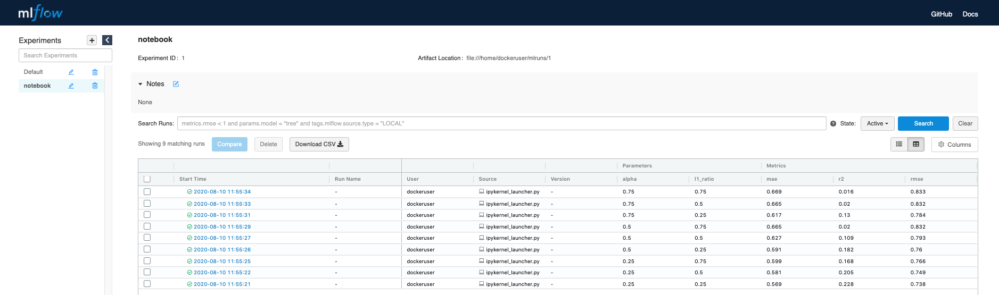
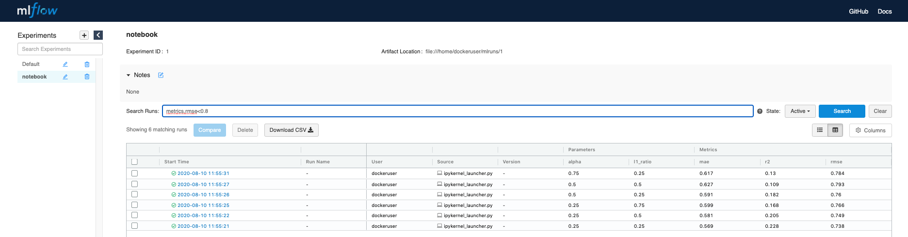
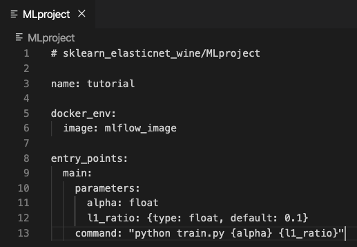
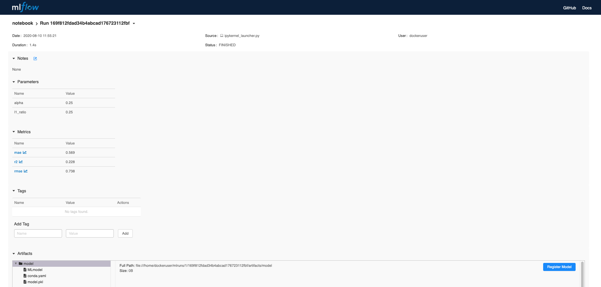

Introduction to MLflow for MLOps Part 2: Docker Environment
===========================================================

After following along with the demos in this three-part repository you will be able to:

* Understand how you and your Data Science teams can improve your MLOps practices using MLflow
* Use all Components of MLflow (Tracking, Projects, Models, Registry)
* Use MLflow in an Anaconda Environment
* Use MLflow with a Docker Environment (including running an IDE inside of a container)
* Use Postgres Backend Store and Minio Artifact Store for Easy Collaboration

The instructions/demos below assume you are using a Mac OSX operating system. Other operating systems can be used with minor modifications. 

|

Table of Contents:
==================
Part 1: Anaconda Environment
----------------------------
(Github: https://github.com/Noodle-ai/mlflow_part1_condaEnv)
(Medium: https://medium.com/p/1fd9e299226f)

1. What is MLflow and Why Should You Use It?
2. Using MLflow with a Conda Environment 

Part 2: Docker Environment
--------------------------
(Github: https://github.com/Noodle-ai/mlflow_part2_dockerEnv)
(Medium: https://medium.com/p/53516ce45266)

1. Using MLflow with a Docker Environment

Part 3: Database Tracking, Minio Artifact Storage, and Registry
---------------------------------------------------------------
(Github: https://github.com/Noodle-ai/mlflow_part1_condaEnv)
(Medium: https://medium.com/p/9fef196aaf42)

1. Running MLflow with a PostgreSQL Database and Minio Artifact Store
2. MLflow Model Registry

|

1. Using MLflow with a Docker Env
=================================
In this section we cover how to use the various features of MLflow with an Docker environment. 

In part 1 of this three part blog we covered using MLflow with an Anaconda environment. Docker has some advantages in terms of scalability compared to Anaconda. If you develop a pipeline in a container afterwards, with minor modifications to your Dockerfile, your pipeline is ready for production. For example, you may need to delete aspects of the Dockerfile used for development (Jupyter library, SSH configuration), include your pipeline script as a command, and add a way to output objects of interest (write to a database, serve over REST). You can then orchestrate containers, running your pipeline with tools like Kubernetes on a cluster that scales with traffic. Alternatively, if you are training in a container (as we do below) you can run containers in parallel on a cluster to do hyperparameter tuning.

|

Setting up for the Tutorial
---------------------------

Note: We will present two options for developing inside a container. The first is running a container locally. The second is running a container remotely (for example in a VM). 

1. Make sure you have Anaconda installed

2. Install the MLflow library in a Python 3 environment

.. code-block:: bash

  conda install -c conda-forge mlflow=1.8.0

3. Install a tool for installing programs (I use Homebrew)

.. code-block:: bash

  /bin/bash -c "$(curl -fsSL https://raw.githubusercontent.com/Homebrew/install/master/install.sh)"

4. Install Git

.. code-block:: bash

  brew install git

5. Install Docker

6. Clone the repository

.. code-block:: bash

  git clone https://github.com/Noodle-ai/mlflow_part2_dockerEnv.git

7. Build an Image from the Dockerfile

Note: The name of your image ("mlflow_image" in this case) must match the name in your MLproject file. 

.. code-block:: bash

  docker image build -t mlflow_image .

The Dockerfile below is used to build an image which creates the conda environment, then sets up SSH with user "dockeruser" and password "123". 

|

8. Build a Container from the Image

We use (-P) to publish all exposed ports in the container to random ports (the argument -P is necessary for the local container workflow, not for the remote container workflow). We use (-d) to run the container in the background. And we use (--mount) to mount the mlflow_part2_dockerEnv repository in the home folder of dockeruser. 

.. code-block:: bash

  docker run -d -P --mount type=bind,source=$(pwd),target=/home/dockeruser --name mlflow_container mlflow_image

9. Determine the Port that Docker Port 22 was published to (necessary for the local container workflow, not for the remote container workflow).

.. code-block:: bash

  docker port mlflow_container 22

10. Get the IP Address of the Container (necessary for the remote container workflow, not for the local container workflow).

This command will return a lot of information about your container. The IP address should be under "NetworkSettings". 

.. code-block:: bash

  docker inspect mlflow_container

|

Examples
--------
The Dockerfile has been configured so that you can SSH to the container. Because of this you can use the container as a development environment. If you are running your container locally you can directly SSH into the container in order to use your IDE within the container itself. I for example will use the SSH extension in VSCode to use VSCode and notebooks within the container. Configure .ssh/config to use host name "dockeruser" (user defined in Dockerfile) and the port returned above in the setup instructions. 

|

If the container is not running locally (for example running in a VM) you can port forward a local port to be connected to the container port in your VM. After you connect your local port to your container you can SSH as if your container was running locally. Choose a <local_port> you would like to use, use the <container_ip_address> that you got in the setup instructions, and lastly use the <vm_ip_address>. After port forwarding you can SSH to <local_port> in order to develop in your container. It is possible you may encounter a permissions issue if you are attempting to connect using a tool like VSCode SSH extension. This extension creates a ".vscode-server" folder inside of the destination folder mounted in the container and dockeruser may not have the permission to do this depending on the default permissions settings in your VM. If this is the case be sure to change the permissions of the "mlflow_part2_dockerEnv" directory you are mounting ("chmod 777 mlflow_part2_dockerEnv"). The command to port forward is below. 

.. code-block:: bash

  ssh -L <local_port>:<container_ip_address>:22 <vm_ip_address>

|

After SSH-ing into the container if using VSCode you may need to install any extensions you need in the container, select a Python interpreter, and then spawn a new terminal. Open experiment.ipynb and follow along. The notebook contains examples demonstrating how to use MLflow Tracking and MLflow Models. It also contains descriptions of how to use MLflow Projects.

Note: If you encounter the warning "Warning: Remote Host Identification Has Changed!" this could be due to a new container being on a port that previously hosted a different container. Delete the entry from "~/.ssh/known_hosts" to resolve the issue. 

| 

Using the Tracking API
^^^^^^^^^^^^^^^^^^^^^^

The MLflow tracking API lets you log metrics and artifacts (files from your data science code) in order to track a history of your runs.

Note: The default behavior of MLflow Tracking creates an mlruns folder. Within this mlruns folder absolute paths are used by MLflow. This creates a conflict when tracking experiments created locally and within a container together. In this section to get around the issue I create a different experiment for runs created within the container and runs created from outside the container (named "notebook" and "script" respectively). From the notebook the experiment can be set using "mlflow.set_experiment('notebook')". But it is worth keeping in mind that the proper way to resolve this issue is to use a database tracking URI (covered in part 3).

The code below logs a run with one parameter (param1), one metric (foo) with three values (1,2,3), and an artifact (a text file containing "Hello world!").

.. code-block:: python

  import mlflow

  mlflow.start_run()

  # Log a parameter (key-value pair)
  mlflow.log_param("param1", 5)
  # Log a metric; metrics can be updated throughout the run
  mlflow.log_metric("foo", 1)
  mlflow.log_metric("foo", 2)
  mlflow.log_metric("foo", 3)
  # Log an artifact (output file)
  with open("output.txt", "w") as f:
      f.write("Hello world!")
  mlflow.log_artifact("output.txt")

  mlflow.end_run()

| 

Viewing the Tracking UI
^^^^^^^^^^^^^^^^^^^^^^^

By default, wherever you run your program, the tracking API writes data into a local ./mlruns directory. You can then run MLflow's Tracking UI.

Activate the MLflow Tracking UI by typing the following into the terminal. You must be in the same folder as mlruns.

.. code-block:: bash

  mlflow ui

View the tracking UI by visiting the URL returned by the previous command. Then click on "notebook" under the Experiments tab.

|

Click on the run to see more details. 

|

|

Click on the metric to see more details.

|

|

Example Incorporating MLflow Tracking, MLflow Models, and MLflow Projects
^^^^^^^^^^^^^^^^^^^^^^^^^^^^^^^^^^^^^^^^^^^^^^^^^^^^^^^^^^^^^^^^^^^^^^^^^

In this example MLflow Tracking is used to keep track of different hyperparameters, performance metrics, and artifacts of a linear regression model. MLflow Models is used to store the pickled trained model instance, a file describing the environment the model instance was created in, and a descriptor file that lists several "flavors" the model can be used in. MLflow Projects is used to package the training code. Lastly MLflow Models is used to deploy the model to a simple HTTP server.

This tutorial uses a dataset to predict the quality of wine based on quantitative features like the wine's "fixed acidity", "pH", "residual sugar", and so on. The dataset is from UCI's machine learning repository.

|

Training the Model
""""""""""""""""""

First, we train a linear regression model that takes two hyperparameters: alpha and l1_ratio.

This example uses the familiar pandas, numpy, and sklearn APIs to create a simple machine learning model. The MLflow tracking APIs log information about each training run like hyperparameters (alpha and l1_ratio) used to train the model, and metrics (root mean square error, mean absolute error, and r2) used to evaluate the model. The example also serializes the model in a format that MLflow knows how to deploy.

Each time you run the example MLflow logs information about your experiment runs in the directory mlruns.

There is a script containing the training code called train.py. You can run the example through the .py script using the following command.

.. code-block:: bash

  python train.py <alpha> <l1_ratio>

There is also a notebook function of the training script. You can use the notebook to run the training (train() function shown below).

.. code-block:: python

  # Wine Quality Sample

  def train(in_alpha, in_l1_ratio):
      import pandas as pd
      import numpy as np
      from sklearn.metrics import mean_squared_error, mean_absolute_error, r2_score
      from sklearn.model_selection import train_test_split
      from sklearn.linear_model import ElasticNet
      import mlflow
      import mlflow.sklearn

      def eval_metrics(actual, pred):
          rmse = np.sqrt(mean_squared_error(actual, pred))
          mae = mean_absolute_error(actual, pred)
          r2 = r2_score(actual, pred)
          return rmse, mae, r2

      np.random.seed(40)

      # Read the wine-quality csv file from the URL
      csv_url =\
          'http://archive.ics.uci.edu/ml/machine-learning-databases/wine-quality/winequality-red.csv'
      data = pd.read_csv(csv_url, sep=';')

      # Split the data into training and test sets. (0.75, 0.25) split.
      train, test = train_test_split(data)

      # The predicted column is "quality" which is a scalar from [3, 9]
      train_x = train.drop(["quality"], axis=1)
      test_x = test.drop(["quality"], axis=1)
      train_y = train[["quality"]]
      test_y = test[["quality"]]

      # Set default values if no alpha is provided
      if float(in_alpha) is None:
          alpha = 0.5
      else:
          alpha = float(in_alpha)

      # Set default values if no l1_ratio is provided
      if float(in_l1_ratio) is None:
          l1_ratio = 0.5
      else:
          l1_ratio = float(in_l1_ratio)

      # Useful for multiple runs   
      with mlflow.start_run():
          # Execute ElasticNet
          lr = ElasticNet(alpha=alpha, l1_ratio=l1_ratio, random_state=42)
          lr.fit(train_x, train_y)

          # Evaluate Metrics
          predicted_qualities = lr.predict(test_x)
          (rmse, mae, r2) = eval_metrics(test_y, predicted_qualities)

          # Print out metrics
          print("Elasticnet model (alpha=%f, l1_ratio=%f):" % (alpha, l1_ratio))
          print("  RMSE: %s" % rmse)
          print("  MAE: %s" % mae)
          print("  R2: %s" % r2)

          # Log parameter, metrics, and model to MLflow
          mlflow.log_param("alpha", alpha)
          mlflow.log_param("l1_ratio", l1_ratio)
          mlflow.log_metric("rmse", rmse)
          mlflow.log_metric("r2", r2)
          mlflow.log_metric("mae", mae)
          mlflow.sklearn.log_model(lr, "model")

|

Comparing the Models
""""""""""""""""""""

Use the MLflow UI (as described above) to compare the models that you have produced.

|

|

You can use the search feature to quickly filter out many models. For example, the query (metrics.rmse < 0.8) returns all the models with root mean square error less than 0.8. For more complex manipulations, you can download this table as a CSV and use your favorite data munging software to analyze it. 

|

|

Loading a Saved Model
"""""""""""""""""""""

After a model has been saved using MLflow Models within MLflow Tracking you can easily load the model in a variety of flavors (python_function, sklearn, etc.). We need to choose a model from the mlruns folder for the model_path.

.. code-block:: python

  model_path = './mlruns/1/<run_id>/artifacts/model'
  mlflow.<model_flavor>.load_model(model_path)

|

Packaging the Training Code in a Docker Container with MLflow Projects
"""""""""""""""""""""""""""""""""""""""""""""""""""""""""""""""""""""""

Note: If you have been following along and are developing within the container, exit the container now. 

Now that you have your training code, you can package it so that other data scientists can easily reuse the training script, or so that you can run the training remotely. 

You do this by using MLflow Projects to specify the dependencies and entry points to your code. The MLproject file specifies that the project has the dependencies located in a Docker image named mlflow_image (created from Dockerfile) and has one entry point (train.py) that takes two parameters: alpha and l1_ratio. 

|

To run this project use mlflow run on the folder containing the MLproject file. 

.. code-block:: bash

  mlflow run . -P alpha=1.0 -P l1_ratio=1.0 --experiment-name script

This builds a new Docker image based on "mlflow_image" that also contains our project code. This resulting image is tagged as "mlflow_image-<git-version> where <git-version> is the git commit ID. After the image is built, MLflow executes the default (main) project entry point within the container using "docker run". 

Environment variables, such as "MLFLOW_TRACKING_URI", are propagated inside the container during project execution. When running against a local tracking URI, MLflow mounts the host system's tracking directory (e.g. a local mlruns directory) inside the container so that metrics and params logged during project execution are accesible afterwards. 

If a repository has an MLproject file you can also run a project directly from GitHub. This tutorial lives in the https://github.com/Noodle-ai/mlflow_part2_dockerEnv repository which you can run with the following command. The symbol "#" can be used to move into a subdirectory of the repo. The "--version" argument can be used to run code from a different branch. The "--experiment-name" argument can be used to choose an experiment name in mlruns. We must set experiment in this case to be different than the experiment ran in the container because absolute paths in MLflow Tracking will lead to an error. The image must be built locally for this to work.

.. code-block:: bash

  mlflow run https://github.com/Noodle-ai/mlflow_part2_dockerEnv -P alpha=1.0 -P l1_ratio=0.8 --experiment-name script

|

Serving the Model (Local REST API Server)
"""""""""""""""""""""""""""""""""""""""""

Now that you have packaged your model using the MLproject convention and have identified the best model, it's time to deploy the model using MLflow Models. An MLflow Model is a standard format for packaging machine learning models that can be used in a variety of downstream tools - for example, real-time serving through a REST API or batch inference on Apache Spark. 

In the example training code above, after training the linear regression model, a function in MLflow saved the model as an artifact within the run.

.. code-block:: bash

  mlflow.sklearn.log_model(lr, "model")

To view this artifact, you can use the UI again. When you click a date in the list of experiment runs you'll see this page.

|

At the bottom, you can see that the call to mlflow.sklearn.log_model produced three files in ./mlruns/1/<run_id>/artifacts/model. The first file, MLmodel, is a metadata file that tells MLflow how to load the model. The second file is a conda.yaml that contains the model dependencies from the Conda environment. The third file, model.pkl, is a serialized version of the linear regression model that you trained. 

In this example, you can use this MLmodel format with MLflow to deploy a local REST server that can serve predictions. 

To deploy the server, run the following command:

.. code-block:: bash

  mlflow models serve -m ./mlruns/1/<run_id>/artifacts/model -p 1234

Note:
The version of Python used to create the model must be the same as the one running "mlflow models serve". If this is not the case, you may see the error 
UnicodeDecodeError: 'ascii' codec can't decode byte 0x9f in position 1: ordinal not in range(128) or raise ValueError, "unsupported pickle protocol: %d".

Once you have deployed the server, you can pass it some sample data and see the predictions. The following example uses curl to send a JSON-serialized pandas DataFrame with the split orientation to the model server. For more information about the input data formats accepted by the model server, see the MLflow deployment tools documentation.

.. code-block:: bash

  curl -X POST -H "Content-Type:application/json; format=pandas-split" --data '{"columns":["alcohol", "chlorides", "citric acid", "density", "fixed acidity", "free sulfur dioxide", "pH", "residual sugar", "sulphates", "total sulfur dioxide", "volatile acidity"],"data":[[12.8, 0.029, 0.48, 0.98, 6.2, 29, 3.33, 1.2, 0.39, 75, 0.66]]}' http://127.0.0.1:1234/invocations

The server should respond with output similar to:

.. code-block:: bash

  [3.7783608837127516]

|

Serving the Model (Serving the Model as a Docker Image)
"""""""""""""""""""""""""""""""""""""""""""""""""""""""

Note: This command is experimental (may be changed or removed in a future release without warning) and does not guarantee that the arguments nor format of the Docker container will remain the same.

Here we build a Docker image whose default entry point serves the specified MLflow model at port 8080 within the container.

The command below builds a docker image named "serve_model" that serves the model in "./mlruns/1/<run_id>/artifacts/model".

.. code-block:: bash

  mlflow models build-docker -m "./mlruns/1/<run_id>/artifacts/model" -n "serve_model"

We can then serve the model, exposing it at port 5001 on the host with the following command:

.. code-block:: bash

  docker run -p 5001:8080 "serve_model"

Once you have created a container that serves the model with the above command, you can pass it some sample data and see the predictions. Similar to above, the following example uses curl to send a JSON-serialized pandas DataFrame with the split orientation to the model server.

.. code-block:: bash

  curl -X POST -H "Content-Type:application/json; format=pandas-split" --data '{"columns":["alcohol", "chlorides", "citric acid", "density", "fixed acidity", "free sulfur dioxide", "pH", "residual sugar", "sulphates", "total sulfur dioxide", "volatile acidity"],"data":[[12.8, 0.029, 0.48, 0.98, 6.2, 29, 3.33, 1.2, 0.39, 75, 0.66]]}' http://127.0.0.1:5001/invocations

Again, the server should respond with an output similar to:

.. code-block:: bash

  [3.7783608837127516]

|

References
==========
The following resources contain all of the information and software used to create this repository.

|

MLflow
------

https://www.mlflow.org/docs/latest/quickstart.html

https://www.mlflow.org/docs/latest/tutorials-and-examples/tutorial.html#conda-example

https://github.com/mlflow/mlflow/tree/master/examples/docker

https://www.mlflow.org/docs/latest/cli.html#mlflow-models-build-docker

|

Docker
------

https://docs.docker.com/engine/examples/running_ssh_service/

|

Homebrew
--------

https://brew.sh/

|

Git
---

https://www.atlassian.com/git/tutorials/install-git

|

Anaconda
-------- 

https://docs.anaconda.com/anaconda/install/mac-os/
